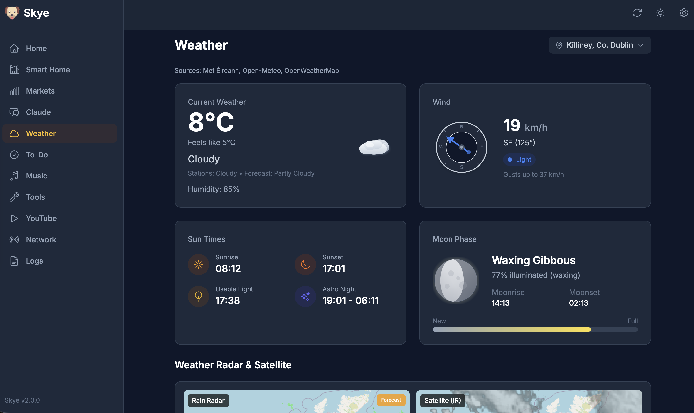
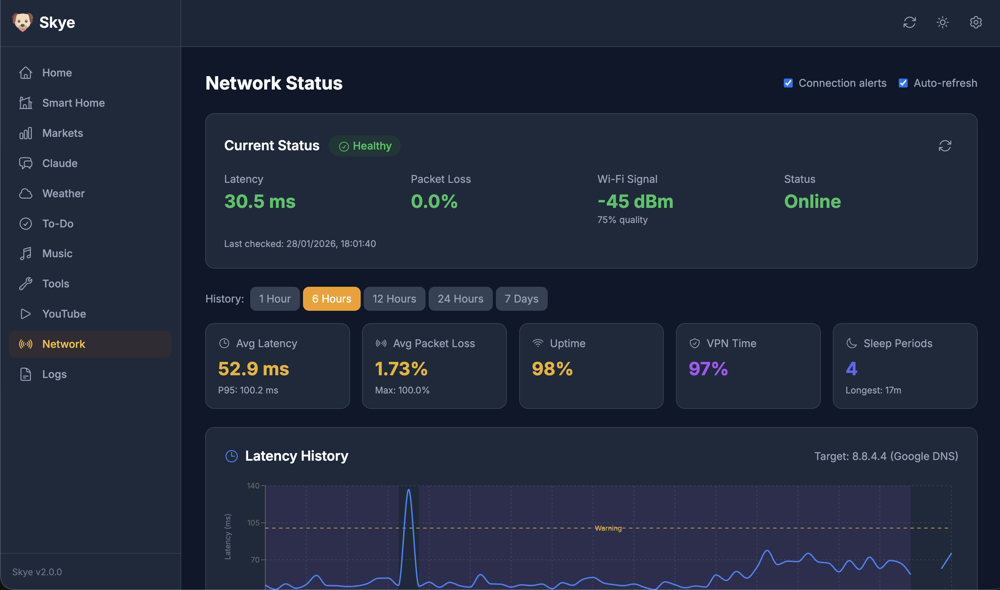
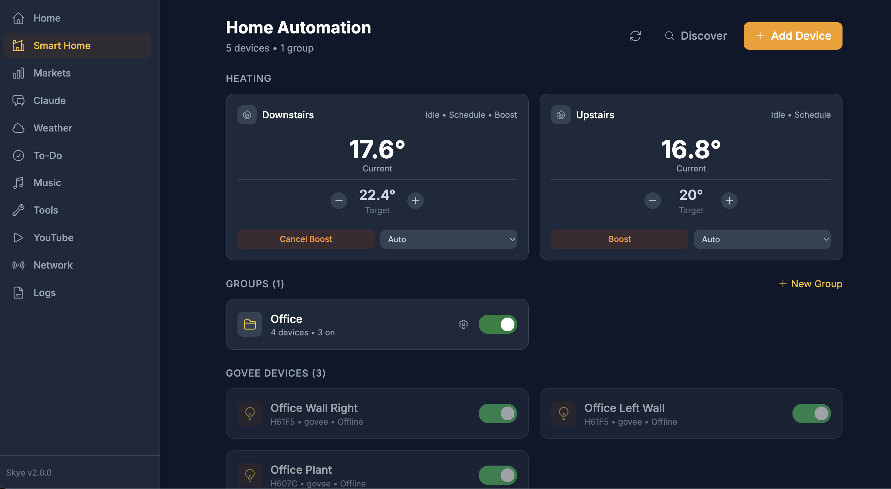

# SkyeJS

A modern personal dashboard built with React and Node.js. This is a complete rewrite of the original [Skye](https://github.com/garnathan/Skye) Python/Flask application, rebuilt from the ground up using modern JavaScript technologies for improved performance, real-time updates, and a better developer experience.


## Why the Rewrite?

The original Skye was built with Python and Flask - great for rapid prototyping but limited in terms of real-time capabilities and modern UI interactions. SkyeJS brings:

- **Real-time updates** via WebSockets (Socket.IO)
- **Modern React UI** with responsive design and smooth animations
- **Better state management** using TanStack Query and Zustand
- **PWA support** for offline capabilities and mobile installation
- **Improved performance** with client-side caching and optimistic updates
- **Hot module replacement** for faster development

## Features

### Dashboard & Markets
- **Stock Tracking** - Real-time AMZN stock prices with interactive historical charts
- **Cryptocurrency** - XRP price monitoring and portfolio tracking
- **Currency Rates** - USD/EUR exchange rate charts
- **Gold Prices** - Gold price tracking with historical data
- **Portfolio Value** - Calculated portfolio value with period comparisons
- **Sell Recommendations** - AI-powered sell signal analysis

### AI Chat
- **Claude Integration** - Chat with Anthropic's Claude AI with model selection
- **Context Support** - Add custom contexts to enhance AI responses
- **Conversation History** - Persistent chat history stored locally

### Weather



- **Multi-Source Aggregation** - Weather data aggregated from 3 sources (Met Éireann, Open-Meteo, OpenWeatherMap) for improved accuracy
- **Current Conditions** - Temperature, humidity, wind, pressure, UV index, and more
- **Hourly Forecast** - 48-hour hourly predictions with synchronized scrolling
- **7-Day Forecast** - Extended daily forecasts with high/low temperatures
- **Sun & Moon** - Sunrise/sunset times and moon phase data
- **Rain Radar** - Animated radar imagery for precipitation tracking
- **Configurable Location** - Set your default location in settings

### To-Do List
- **Work & Personal Lists** - Separate lists for work and personal tasks with tab switching
- **Task Management** - Create, edit, and delete tasks with notes
- **Move Between Lists** - Easily move items between work and personal lists
- **Priority Items** - Star important items to keep them at the top
- **Drag & Drop** - Reorder tasks with drag-and-drop
- **Reminders** - Set reminder dates for tasks
- **Browser Notifications** - Get notified when tasks are due or overdue
- **Persistence** - Tasks saved to server and persist across sessions

### Network Monitoring



- **Real-Time Status** - Current latency, packet loss, and connection health
- **Wi-Fi Signal** - Monitor Wi-Fi signal strength and quality
- **VPN Detection** - Automatically detects VPN connections
- **Historical Charts** - Latency, packet loss, and signal history (1h to 7d)
- **Sleep Detection** - Automatically detects laptop sleep/wake cycles to prevent false alerts
- **Connection Alerts** - Global alerts when connection is lost or restored (suppressed during sleep)
- **Statistics** - Uptime percentage, average latency, and gap detection

### Smart Home



- **Govee Devices** - Auto-discovery and control of Govee lights via LAN
- **TP-Link Tapo** - Control Tapo smart devices (lights, plugs)
- **Device Control** - Power on/off, brightness, and color controls
- **Add Devices** - Add Tapo devices by IP address

### YouTube Tools
- **Playlist Browser** - Browse any YouTube channel's playlists
- **Playlist Copier** - Copy playlists between YouTube accounts (OAuth)
- **Audio Download** - Extract MP3 audio from YouTube videos (requires yt-dlp)

### Tools
- **VRT Calculator** - Irish Vehicle Registration Tax calculator for importing cars from the UK

### Music Discovery
- **Artist Exploration** - Discover similar artists via Last.fm integration

### System
- **Logs Viewer** - View and filter system activity logs
- **Settings** - Configure API keys, portfolio, weather location, and more
- **Dark Mode** - Toggle between light and dark themes

## Tech Stack

### Frontend
- **React 18** with Vite for fast development and builds
- **TanStack Query** for server state management and caching
- **Zustand** for client state
- **Tailwind CSS** for styling
- **Recharts** for data visualization
- **Framer Motion** for animations
- **@hello-pangea/dnd** for drag-and-drop
- **Socket.IO client** for real-time updates
- **PWA support** with offline capabilities

### Backend
- **Node.js** with Express
- **Socket.IO** for WebSocket connections
- **Winston** for logging
- **node-cache** for response caching
- **Opossum** for circuit breaker patterns

## Getting Started

### Prerequisites
- Node.js 18+
- npm 9+

### Quick Start

```bash
git clone https://github.com/garnathan/SkyeJS.git
cd SkyeJS
cp .env.example .env
npm run dev
```

That's it! Dependencies install automatically on first run.

The app will be available at http://localhost:5055

### Configuration

Most features work out of the box. To enable AI chat, add your Anthropic API key to `.env`:

```env
ANTHROPIC_API_KEY=your_claude_api_key
```

All other settings (weather location, smart home, portfolio) can be configured in the **Settings** page within the app, or by editing `.env` directly. See [Environment Variables](#environment-variables) for the full list.

### Using the Start Script

For background operation with auto-restart:

```bash
# Start Skye
./scripts/start_skye.sh start

# Check status
./scripts/start_skye.sh status

# Stop Skye
./scripts/start_skye.sh stop

# Restart
./scripts/start_skye.sh restart

# View logs
./scripts/start_skye.sh logs

# Start with keep-alive monitor
./scripts/start_skye.sh monitor
```

## Project Structure

```
SkyeJS/
├── client/                 # React frontend
│   ├── src/
│   │   ├── components/     # Reusable UI components
│   │   │   ├── features/   # Feature-specific components
│   │   │   ├── layout/     # Layout components (Sidebar, Header)
│   │   │   └── ui/         # Base UI components (Button, Card, Modal)
│   │   ├── pages/          # Page components
│   │   ├── hooks/          # Custom React hooks
│   │   ├── services/       # API client
│   │   ├── store/          # Zustand stores
│   │   └── styles/         # Global styles
│   └── vite.config.js
├── server/                 # Express backend
│   ├── routes/             # API endpoints
│   │   └── dashboard/      # Market data routes
│   ├── services/           # Business logic
│   ├── middleware/         # Express middleware
│   └── utils/              # Utilities
├── scripts/                # Utility scripts
│   ├── start_skye.sh       # Start/stop control script
│   ├── keep_alive.js       # Auto-restart monitor
│   └── check-deps.js       # Dependency checker
├── data/                   # Persistent data storage
└── package.json            # Root package with workspaces
```

## API Endpoints

### Dashboard
- `GET /api/stock-data` - Stock chart data
- `GET /api/current-price` - Current stock price
- `GET /api/xrp-data` - XRP chart data
- `GET /api/xrp-price` - Current XRP price
- `GET /api/currency-data` - USD/EUR chart data
- `GET /api/currency-rate` - Current exchange rate
- `GET /api/gold-data` - Gold chart data
- `GET /api/gold-price` - Current gold price
- `GET /api/portfolio-value` - Portfolio value calculation
- `GET /api/sell-recommendation` - Get sell signals

### AI Chat
- `GET /api/claude/models` - Available Claude models
- `GET /api/claude/contexts` - Available context files
- `POST /api/claude/chat` - Send message to Claude

### Weather
- `GET /api/weather` - Aggregated weather forecast
- `GET /api/weather/sun` - Sunrise/sunset times
- `GET /api/weather/moon` - Moon phase data
- `GET /api/weather/radar` - Rain radar imagery
- `GET /api/weather/defaults` - Default location settings

### To-Do
- `GET /api/todos` - Get all todos (returns `{ work: [], personal: [] }`)
- `GET /api/todos?list=work` - Get todos for specific list
- `POST /api/todos` - Create todo (include `list` field)
- `PUT /api/todos/:id` - Update todo (set `list` to move between lists)
- `DELETE /api/todos/:id` - Delete todo
- `POST /api/todos/reorder` - Reorder todos (include `list` field)

### Network
- `GET /api/network/current` - Current network status
- `GET /api/network/history/:period` - Historical data
- `GET /api/network/stats/:period` - Statistics for period
- `GET /api/network/diagnostics` - Full network diagnostics

### Smart Home
- `GET /api/home/devices` - Get all smart home devices
- `POST /api/home/refresh` - Re-scan for devices
- `POST /api/home/devices/:provider/:id/power` - Set device power state
- `POST /api/home/devices/:provider/:id/brightness` - Set brightness
- `POST /api/home/devices/:provider/:id/color` - Set color
- `POST /api/home/tapo/devices` - Add a Tapo device by IP
- `DELETE /api/home/tapo/devices/:id` - Remove a Tapo device

### YouTube
- `GET /api/youtube/playlists` - Get channel playlists
- `GET /api/youtube/playlist-videos` - Get playlist videos
- `POST /api/youtube/download-audio` - Download audio
- `POST /api/youtube/copy-playlists` - Copy playlists

### Tools
- `POST /api/tools/vrt-calculate` - Calculate VRT
- `GET /api/tools/exchange-rate` - Get GBP/EUR rate

### Settings
- `GET /api/settings/schema` - Get settings schema
- `PUT /api/settings` - Update settings
- `DELETE /api/settings/:key` - Clear a setting

### System
- `GET /api/logs` - Get system logs
- `POST /api/logs/clear` - Clear logs
- `GET /health` - Health check

## Scripts

```bash
# Development
npm run dev           # Start both servers (auto-installs deps if missing)
npm run dev:server    # Start backend only
npm run dev:client    # Start frontend only

# Production
npm run build         # Build frontend
npm run start         # Start production server

# Setup
npm run setup         # Install dependencies and build

# Linting
npm run lint          # Run ESLint on all workspaces
```

## Environment Variables

| Variable | Description | Required |
|----------|-------------|----------|
| `PORT` | Server port (default: 3001) | No |
| `NODE_ENV` | Environment (development/production) | No |
| `ANTHROPIC_API_KEY` | Anthropic API key for Claude | Yes* |
| `OPENWEATHERMAP_API_KEY` | OpenWeatherMap One Call API 3.0 key | No |
| `YOUTUBE_API_KEY` | YouTube Data API key | No |
| `YOUTUBE_CLIENT_ID` | YouTube OAuth client ID | No |
| `YOUTUBE_CLIENT_SECRET` | YouTube OAuth client secret | No |
| `TAPO_EMAIL` | TP-Link account email for Tapo devices | No |
| `TAPO_PASSWORD` | TP-Link account password | No |
| `AMZN_SHARES` | Number of AMZN shares owned | No |
| `CASH_ASSETS_EUR` | Cash holdings in EUR | No |
| `XRP_QUANTITY` | Amount of XRP owned | No |
| `WEATHER_DEFAULT_LAT` | Default weather latitude | No |
| `WEATHER_DEFAULT_LNG` | Default weather longitude | No |
| `WEATHER_DEFAULT_NAME` | Default weather location name | No |
| `USER_NAME` | Your name for personalized greetings | No |

*Required for AI chat feature

## Weather Data Aggregation

Weather data is aggregated from 3 sources to provide more accurate forecasts:
- **Met Éireann** - Irish meteorological service
- **Open-Meteo** - Free weather API
- **OpenWeatherMap** - One Call API 3.0 (rate-limited to 950 calls/day)

Each weather field is averaged from all available sources. Wind direction uses circular averaging to handle the 0°/360° boundary correctly.

## Smart Home Setup

### Govee Devices
Govee devices are automatically discovered on your local network via UDP multicast. No configuration required - just ensure your Govee devices have LAN control enabled in the Govee app.

### TP-Link Tapo Devices
1. Add your TP-Link account credentials to `.env`:
   ```env
   TAPO_EMAIL=your_email@example.com
   TAPO_PASSWORD=your_password
   ```
2. In the Smart Home page, click "Add Device" and enter the device's IP address
3. Devices are controlled locally but require TP-Link account authentication

## Comparison with Original Skye (Python)

| Feature | Skye (Python) | SkyeJS |
|---------|---------------|--------|
| Backend | Flask | Express + Node.js |
| Frontend | Jinja2 templates | React 18 |
| Real-time | Polling | WebSockets (Socket.IO) |
| State Management | Server-side | TanStack Query + Zustand |
| Styling | Custom CSS | Tailwind CSS |
| Build Tool | None | Vite |
| PWA Support | No | Yes |
| AI Integration | Gemini | Claude |

## License

MIT
